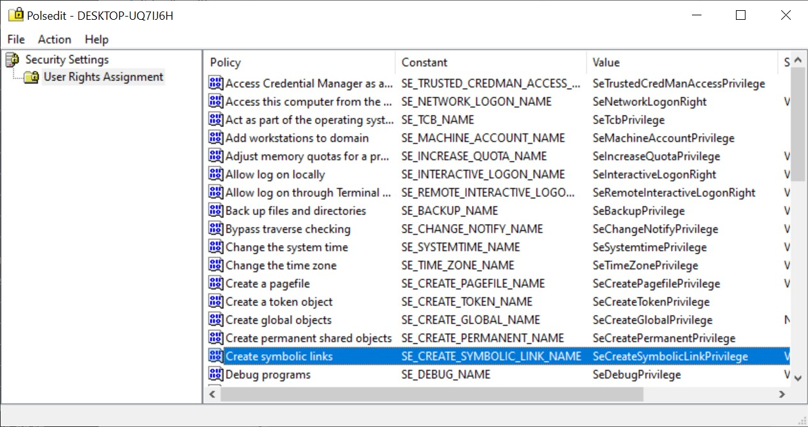
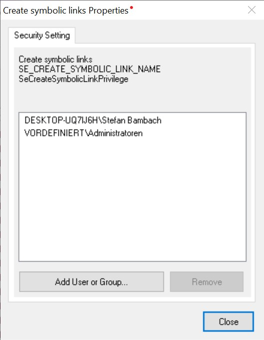
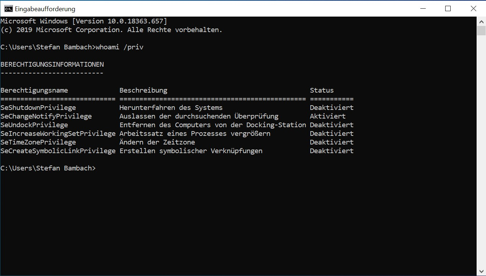

# Symlink support for vagrant+Virtualbox on windows

## Program versions used

- Windows 10 Pro (1909)
- VirtualBox 6.0.16
- vagrant 2.2.7
- git-bash 2.25.1

## Activate symlink support within windows (*SeCreateSymbolicLinkPrivilege*)

See also official documentation about [Create symbolic links](https://docs.microsoft.com/en-us/windows/security/threat-protection/security-policy-settings/create-symbolic-links) in windows.

You **must have Administrators rights on the local device**, or you must have the appropriate permissions to update a Group Policy Object (GPO) on the domain controller to perform these procedures.

1) Get a policy editor e.g. [here](https://www.southsoftware.com/polsedit.html) and extract it. (Original policy editor from Microsoft is working too, but not that easy.)
2) Start `polseditx64.exe` and double click *SeCreateSymbolicLinkPrivilege*:  
   
3) Now add your own user to the list  
   

## Reboot windows

## Check if symlinks are activated

Login back to windows and test if your user now knows about the new permission.

1) Open `cmd` (DOS Box)
2) Call command `whoami /priv`  
   
3) You should be able to see a line containing *SeCreateSymbolicLinkPrivilege* (Ignore the *disabled*. It's ok.)

## Test within vagrant

1) Open `git-bash` console
2) Change directory to where your Vagrantfile is, e.g. `cd ~/vagrant-box/`
3) Execute this:

      ```bash
      # Restart box
      vagrant halt ; vagrant up
      # Now test if symlinks are created
      vagrant ssh -c 'cd /vagrant ; rm -f t.txt t_ln.txt ; touch t.txt ; ln -s t.txt t_ln.txt ; test -f t.txt -a ! -L t.txt && echo "[OK] File exists." || echo "[ERROR] File does not exist" ; test -f t_ln.txt -a -L t_ln.txt && echo "[OK] Symlink exists." || echo "[ERROR] Symlink does not exist" ; rm -f t.txt t_ln.txt'
      ```
